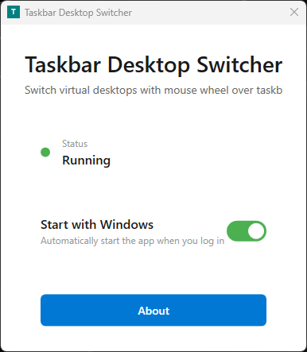
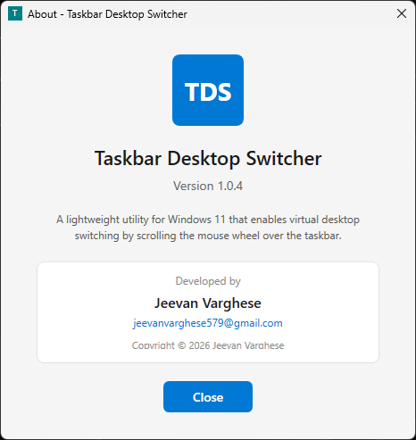

# Taskbar-Windows-Switcher
Taskbar Windows Switcher is a lightweight Windows utility that lets you switch virtual desktops by scrolling your mouse wheel over the taskbar. No hotkeys, no clicks — just hover and scroll to move between workspaces instantly. Built for speed and simplicity, it stays out of your way while making multitasking feel effortless.

# Taskbar Windows Switcher

## Screenshot

